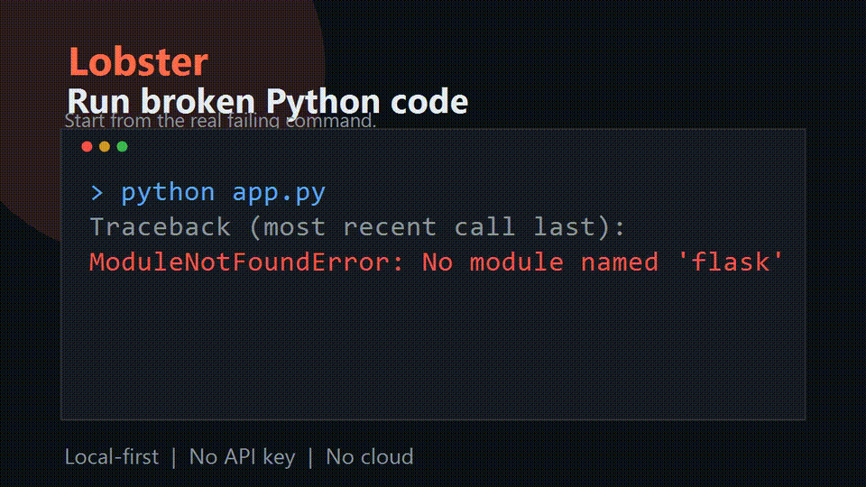

> Original project: **Lobster** / **Lobster AI System** — local-first Python runtime repair.

# Lobster

## A local-first Python repair engine for developers, CI, and AI agent workflows.

Run broken Python code. Capture the real crash. Apply the smallest safe repair. Verify by rerunning the same command.

No API key. No cloud. No prompt guessing. No full-project rewrite.

```text
BROKEN CODE → CRASH → FIX → RETRY → ✅ SUCCESS
```

Lobster is a local-first repair loop for Python runtime failures. It runs your command, reads the real error, applies a small safe fix, then reruns the same command to prove the repair worked.

Use it when you want a boring, inspectable repair primitive instead of a black-box coding agent.

## What It Is

Lobster is not a chatbot and not a general autonomous developer.

It is a deterministic repair loop for Python runtime failures:

- **Local-first:** the base engine runs without sending source code to a cloud service.
- **Crash-driven:** it starts from actual stderr/stdout, not a vague prompt.
- **Small-patch biased:** it prefers narrow actions over broad rewrites.
- **Safe by default:** dry-run is the default; `--apply` is required for changes.
- **Automation-ready:** JSON reports make it usable from CI, launchers, and agent runtimes.

If this saves you time, a GitHub star helps the project reach more builders.

## Latest Update: v0.1.2

This release adds machine-readable JSON reports for automation, CI, and agent workflows:

- `run --json-report` prints command results as structured JSON.
- `repair --json-report` prints iteration, suggestion, preview, apply, and verification state.
- JSON output stays quiet and parseable instead of mixing in human logs.
- Test coverage increased to `25 passed`.

## Previous Update: v0.1.1

This release focuses on first-run trust and CLI polish after black-box testing the project like a new user:

- Invalid options now return clear CLI errors instead of Python tracebacks.
- Dry-run mode now says `[PREVIEW] no changes were made`, so users know it is safe.
- Missing or mistyped target commands are recognized as `command_start_error` with PATH / `--` usage guidance.
- README examples now match the real command output.
- Test coverage increased to `23 passed`.

## 10-Second Demo



Watch the MP4 version: [docs/assets/lobster-demo.mp4](docs/assets/lobster-demo.mp4)

That is the whole idea: **run the broken thing, repair the real failure, verify the result.**

## Try It

Clone and install locally:

```powershell
git clone https://github.com/guohuancui123-a11y/lobster-ai-system.git
cd lobster-ai-system
python -m pip install -e .
```

Dry-run first. Lobster shows the repair without changing anything:

```powershell
python -m lobster_ai_system repair -- python demo/missing_file.py
```

```text
[RUN] python demo/missing_file.py
[ERROR] FileNotFoundError: [Errno 2] No such file or directory: 'demo\\generated\\config.txt'

[FIX] file_not_found
[FIX] Missing file or path: demo\\generated\\config.txt
[FIX] actions:
  - create_path:demo\\generated\\config.txt

[PREVIEW] no changes were made; rerun with --apply to execute this fix
[APPLY] reason: apply disabled; rerun with --apply to execute safe fix commands

[VERIFY] not rerun; preview mode only
```

Then let it repair and verify:

```powershell
python -m lobster_ai_system repair --apply --max-iterations 2 -- python demo/missing_file.py
```

```text
[ITERATION 1]
[RUN] python demo/missing_file.py
[ERROR] FileNotFoundError: missing demo\\generated\\config.txt

[FIX] create missing file
[APPLY] ok: True

[ITERATION 2]
[RUN] python demo/missing_file.py
[EXIT] 0

[SUCCESS]
[VERIFY] success
```

## Why This Is Different

Most AI coding tools start with a prompt.

Lobster starts with the crash.

It does not try to rewrite your whole project. It watches what failed, matches the failure to a known repair pattern, applies the smallest local fix, and verifies by running the original command again.

```text
RUN → OBSERVE ERROR → SUGGEST FIX → APPLY → VERIFY → REPEAT
```

## What Lobster Can Repair Today

| Runtime signal | Local repair behavior |
| --- | --- |
| `ModuleNotFoundError` | Reads `requirements.txt` when available and suggests/applies `pip install`. |
| Flask/Werkzeug compatibility errors | Suggests/applies a compatible Werkzeug version for Flask 2.0-era failures. |
| `FileNotFoundError` | Creates missing local files or directories. |
| `SyntaxError: expected ':'` | Appends a missing colon to the reported line and records rollback metadata. |
| SQLite unable to open database | Creates the missing local `data/` directory. |
| SQLite missing `users` table | Creates a minimal smoke-test `users` table and seeds `Local User`. |
| Unknown errors | Reports conservative guidance only; no forced patch. |

## Why Local-First Matters

Lobster's base engine is intentionally boring in the best way:

- No required external AI API.
- No required API key.
- No required account.
- No source upload to a remote service.
- No automatic changes unless `--apply` is passed.
- No whole-file rewrite engine.
- No pretend confidence for unknown errors.

Optional AI-enhanced layers may exist later, but the core repair engine must remain useful offline.

## Install

From a local checkout:

```powershell
cd lobster-ai-system
python -m pip install -e .
```

For development:

```powershell
python -m pip install -e .[dev]
```

After installation, use either module mode:

```powershell
python -m lobster_ai_system repair -- python demo/missing_file.py
```

or the console command:

```powershell
lobster-ai repair -- python demo/missing_file.py
```

## CLI

Observe a command without applying changes:

```powershell
python -m lobster_ai_system run -- <command>
```

Suggest a repair without changing anything:

```powershell
python -m lobster_ai_system repair -- <command>
```

Apply safe repairs and rerun the original command:

```powershell
python -m lobster_ai_system repair --apply --max-iterations 4 -- <command>
```

Print a machine-readable report for automation or CI:

```powershell
python -m lobster_ai_system repair --json-report -- python demo/missing_file.py
```

```json
{
  "ok": false,
  "verified": false,
  "preview": true,
  "iterations": [
    {
      "iteration": 1,
      "run": {
        "ok": false,
        "suggestion": {
          "kind": "file_not_found",
          "summary": "Missing file or path: demo\\generated\\config.txt"
        }
      }
    }
  ]
}
```

## Example: Dependency Repair

If a script fails with a missing import:

```text
ModuleNotFoundError: No module named 'tomli_w'
```

Lobster can produce:

```text
[FIX] module_not_found
[FIX] Missing Python module: tomli_w
[FIX] commands:
  - python -m pip install tomli-w
```

When `--apply` is enabled, it runs the safe command, then reruns the original target command to verify the result.

## Example: Syntax Repair

For a narrow missing-colon error:

```python
def main()
    print("hello")
```

Lobster can apply the smallest patch:

```python
def main():
    print("hello")
```

When it edits an existing file, rollback metadata is written under:

```text
.lobster/rollback/
```

## Project Structure

```text
lobster-ai-system/
├── lobster_ai_system/
│   ├── core/
│   │   ├── apply_engine.py
│   │   ├── fix_engine.py
│   │   └── __init__.py
│   ├── ai/
│   │   └── __init__.py
│   ├── cli.py
│   └── __main__.py
├── demo/
├── tests/
├── .github/workflows/ci.yml
├── CONTRIBUTING.md
├── SECURITY.md
├── RELEASE_NOTES.md
├── pyproject.toml
└── LICENSE
```

## Development

Run the test suite:

```powershell
python -m pytest -q
```

Current validation:

```text
25 passed
```

Check the installed CLI:

```powershell
lobster-ai --help
```

## Safety Model

Lobster is a repair assistant, not a magic autopilot.

- Dry-run mode is the default.
- `--apply` is required before automatic changes happen.
- Unknown errors do not get force-fixed.
- File edits are narrow and rollback metadata is recorded.
- Package manager commands are generated from explicit rules.
- You should run Lobster only inside projects you trust.

## Roadmap

- Patch preview before apply.
- Rollback restore command.
- More local `SyntaxError` repair templates.
- Conservative guards for selected `TypeError` and `IndexError` patterns.
- More dependency compatibility rules.
- Public demo repositories with before/after repair runs.
- Optional AI enhancement layer that never blocks offline use.

## Status

`v0.1.0` is the first public prototype: small, local, rule-driven, and test-covered.

It is ready for early users, demos, and source review. The next milestone is broader repair coverage and better patch preview/rollback UX.

## Origin

This project was originally created as **Lobster AI System**.

Official short name: **Lobster**

Original repository: `https://github.com/guohuancui123-a11y/lobster-ai-system`

Author: **guohuancui123-a11y**

Lobster is open source under the MIT License. Forks, modifications, demos, and experiments are welcome. If you fork or modify this project, please retain attribution to the original project and repository so users can trace the work back to its source.

## Attribution and Fair Use

Lobster is intentionally open source, but it is not anonymous raw material. If this project saves you time, please help the original project stay discoverable:

- Star the original repository if you use or clone it seriously.
- Keep the upstream link in forks, demos, tutorials, binary packages, screenshots, generated reports, and hosted wrappers.
- Do not remove the Lobster identity and present a lightly modified copy as an unrelated original project.
- Use `NOTICE`, `CITATION.cff`, and `BRANDING.md` when publishing derivative work.

Human-readable CLI output and JSON reports include a source attribution field so logs, demos, and automation artifacts can trace back to the original repository.

Recommended attribution line:

```text
Built with Lobster AI System (https://github.com/guohuancui123-a11y/lobster-ai-system)
```

## License

MIT
