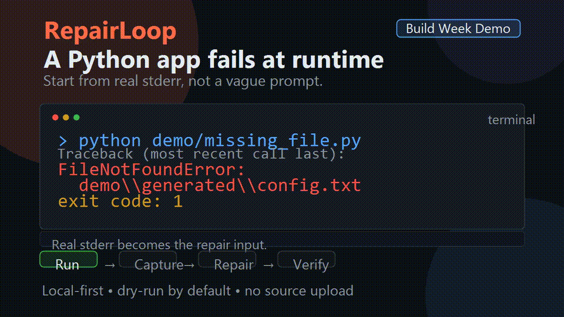

# RepairLoop

RepairLoop is the original local-first Python runtime repair engine created and maintained by [guohuancui123-a11y](https://github.com/guohuancui123-a11y).

Copyright (c) 2026 Guohuancui.

Local-first Python runtime repair engine.

Run → Capture → Repair → Verify.

RepairLoop automatically diagnoses failed Python commands, applies minimal fixes, and verifies the result by rerunning the same command.

No cloud. No API key. No source upload. No full-project rewrite.

```text
BROKEN PYTHON COMMAND → REAL CRASH → MINIMAL FIX → RERUN → VERIFIED
```

## 10-Second Demo



Watch the MP4 version: [docs/assets/repairloop-demo.mp4](docs/assets/repairloop-demo.mp4)

Social preview image: [docs/assets/repairloop-social-preview.png](docs/assets/repairloop-social-preview.png)

That is the whole idea: **run the broken thing, repair the real failure, verify the result.**

## Quick Example

A Python script fails because a local config file is missing:

```powershell
python demo/missing_file.py
```

```text
FileNotFoundError: [Errno 2] No such file or directory: 'demo\generated\config.txt'
```

Preview the repair first:

```powershell
repair-loop repair -- python demo/missing_file.py
```

```text
[FIX] file_not_found
[FIX] Missing file or path: demo\generated\config.txt
[FIX] actions:
  - create_path:demo\generated\config.txt

[PREVIEW] no changes were made; rerun with --apply to execute this fix
```

Then apply and verify:

```powershell
repair-loop repair --apply -- python demo/missing_file.py
```

```text
[APPLY] ok: True
[VERIFY] success
```

## Why RepairLoop?

Most coding assistants generate patches.

RepairLoop focuses on something narrower and more verifiable:

**Can the program run again?**

It follows a crash-driven repair loop:

```text
Failure → Diagnosis → Minimal repair → Execution verification
```

That makes it useful as a local developer tool, a CI primitive, or a repair layer inside agent workflows.

## What It Is

RepairLoop is not a chatbot and not a general autonomous developer.

It is a deterministic repair loop for Python runtime failures:

- **Local-first:** the base engine runs without sending source code to a cloud service.
- **Crash-driven:** it starts from actual stderr/stdout, not a vague prompt.
- **Small-patch biased:** it prefers narrow actions over broad rewrites.
- **Safe by default:** dry-run is the default; `--apply` is required for changes.
- **Automation-ready:** JSON reports make it usable from CI, launchers, and agent runtimes.

If this saves you time, a GitHub star helps the project reach more builders.

## Install

```powershell
git clone https://github.com/guohuancui123-a11y/repairloop.git
cd repairloop
python -m pip install -e .
```

After installation, use either module mode:

```powershell
python -m repair_loop repair -- python demo/missing_file.py
```

or the console command:

```powershell
repair-loop repair -- python demo/missing_file.py
```

## What RepairLoop Can Repair Today

| Runtime signal | Local repair behavior |
| --- | --- |
| `ModuleNotFoundError` | Reads `requirements.txt` when available and suggests/applies `pip install`. |
| Flask/Werkzeug compatibility errors | Suggests/applies a compatible Werkzeug version for Flask 2.0-era failures. |
| `FileNotFoundError` | Creates missing local files or directories. |
| `SyntaxError: expected ':'` | Appends a missing colon to the reported line and records rollback metadata. |
| SQLite unable to open database | Creates the missing local `data/` directory. |
| SQLite missing `users` table | Creates a minimal smoke-test `users` table and seeds `Local User`. |
| Unknown errors | Reports conservative guidance only; no forced patch. |

## Why Local-First Matters

RepairLoop's base engine is intentionally boring in the best way:

- No required external AI API.
- No required API key.
- No required account.
- No source upload to a remote service.
- No automatic changes unless `--apply` is passed.
- No whole-file rewrite engine.
- No pretend confidence for unknown errors.

Optional AI-enhanced layers may exist later, but the core repair engine must remain useful offline.

## Development Setup

Install development dependencies from a local checkout:

```powershell
python -m pip install -e .[dev]
```

## CLI

Observe a command without applying changes:

```powershell
python -m repair_loop run -- <command>
```

Suggest a repair without changing anything:

```powershell
python -m repair_loop repair -- <command>
```

Apply safe repairs and rerun the original command:

```powershell
python -m repair_loop repair --apply --max-iterations 4 -- <command>
```

Print a machine-readable report for automation or CI:

```powershell
python -m repair_loop repair --json-report -- python demo/missing_file.py
```

```json
{
  "ok": false,
  "verified": false,
  "preview": true,
  "iterations": [
    {
      "iteration": 1,
      "run": {
        "ok": false,
        "suggestion": {
          "kind": "file_not_found",
          "summary": "Missing file or path: demo\\generated\\config.txt"
        }
      }
    }
  ]
}
```

## Example: Dependency Repair

If a script fails with a missing import:

```text
ModuleNotFoundError: No module named 'tomli_w'
```

RepairLoop can produce:

```text
[FIX] module_not_found
[FIX] Missing Python module: tomli_w
[FIX] commands:
  - python -m pip install tomli-w
```

When `--apply` is enabled, it runs the safe command, then reruns the original target command to verify the result.

## Example: Syntax Repair

For a narrow missing-colon error:

```python
def main()
    print("hello")
```

RepairLoop can apply the smallest patch:

```python
def main():
    print("hello")
```

When it edits an existing file, rollback metadata is written under:

```text
.repairloop/rollback/
```

## Project Structure

```text
repairloop/
├── repair_loop/
│   ├── core/
│   │   ├── apply_engine.py
│   │   ├── fix_engine.py
│   │   └── __init__.py
│   ├── ai/
│   │   └── __init__.py
│   ├── cli.py
│   └── __main__.py
├── demo/
├── tests/
├── .github/workflows/ci.yml
├── CONTRIBUTING.md
├── SECURITY.md
├── RELEASE_NOTES.md
├── pyproject.toml
└── LICENSE
```

## Development

Run the test suite:

```powershell
python -m pytest -q
```

Current validation:

```text
25 passed
```

Check the installed CLI:

```powershell
repair-loop --help
```

## Safety Model

RepairLoop is a repair assistant, not a magic autopilot.

- Dry-run mode is the default.
- `--apply` is required before automatic changes happen.
- Unknown errors do not get force-fixed.
- File edits are narrow and rollback metadata is recorded.
- Package manager commands are generated from explicit rules.
- You should run RepairLoop only inside projects you trust.

## Roadmap

- Patch preview before apply.
- Rollback restore command.
- More local `SyntaxError` repair templates.
- Conservative guards for selected `TypeError` and `IndexError` patterns.
- More dependency compatibility rules.
- Public demo repositories with before/after repair runs.
- Optional AI enhancement layer that never blocks offline use.

## Status

`v0.1.0` is the first public prototype: small, local, rule-driven, and test-covered.

It is ready for early users, demos, and source review. The next milestone is broader repair coverage and better patch preview/rollback UX.

## Origin

This project was originally created as **RepairLoop**.

Official short name: **RepairLoop**

Original repository: `https://github.com/guohuancui123-a11y/repairloop`

Author: **guohuancui123-a11y**

RepairLoop is open source under the MIT License. Forks, modifications, demos, and experiments are welcome. If you fork or modify this project, please retain attribution to the original project and repository so users can trace the work back to its source.

## Attribution and Fair Use

RepairLoop is intentionally open source, but it is not anonymous raw material. If this project saves you time, please help the original project stay discoverable:

- Star the original repository if you use or clone it seriously.
- Keep the upstream link in forks, demos, tutorials, binary packages, screenshots, generated reports, and hosted wrappers.
- Do not remove the RepairLoop identity and present a lightly modified copy as an unrelated original project.
- Use `NOTICE`, `CITATION.cff`, and `BRANDING.md` when publishing derivative work.

Human-readable CLI output and JSON reports include a source attribution field so logs, demos, and automation artifacts can trace back to the original repository.

For commercial positioning and the Community/Pro split, see [`COMMERCIAL.md`](COMMERCIAL.md).

Recommended attribution line:

```text
Built with RepairLoop (https://github.com/guohuancui123-a11y/repairloop)
```

## License

MIT
